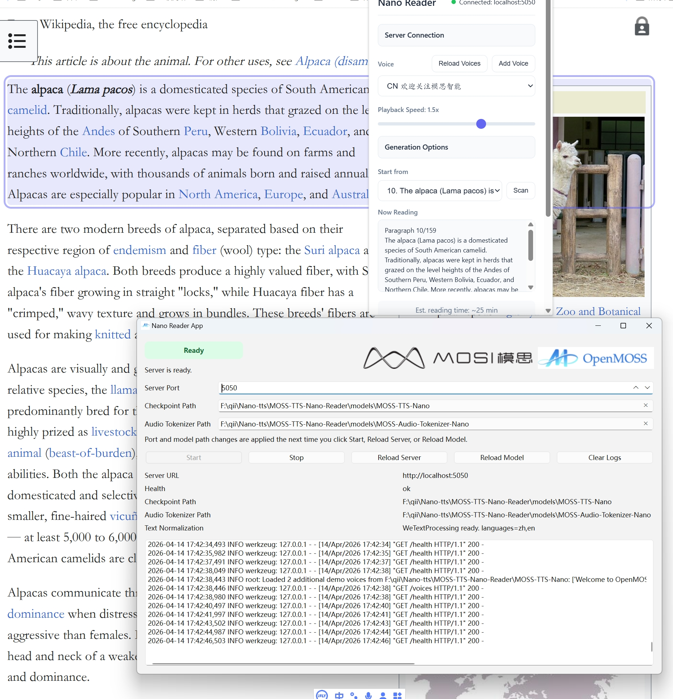

# MOSS-TTS-Nano Reader

<br>

<p align="center">
  
  &nbsp;&nbsp;&nbsp;&nbsp;
  
</p>

<div align="center">
  <a href="https://clawhub.ai/luogao2333/moss-tts-voice"></a>
  <a href="https://huggingface.co/OpenMOSS-Team/MOSS-TTS-Nano"></a>
  <a href="https://modelscope.cn/collections/OpenMOSS-Team/MOSS-TTS-Nano"></a>
  <a href="https://mosi.cn/#models"></a>
  <a href="https://arxiv.org/abs/2603.18090"></a>
  <a href="https://studio.mosi.cn/experiments/moss-tts-nano"></a>
  <a href="https://studio.mosi.cn/docs/moss-tts-nano"></a>
  <a href="https://x.com/Open_MOSS"></a>
  <a href="https://discord.gg/Xf3aXddCjc"></a>
  <a href="./assets/images/wechat.jpg"></a>
</div>

[English](README.md) | [简体中文](README_zh.md)

MOSS-TTS-Nano Reader 是一个基于 [MOSS-TTS-Nano](https://github.com/OpenMOSS/MOSS-TTS-Nano) 的本地浏览器网页朗读应用。


## 演示




## 目录

- [演示](#演示)
- [介绍](#介绍)
  - [主要特性](#主要特性)
- [支持的语言](#支持的语言)
- [快速开始](#快速开始)
  - [获取仓库](#获取仓库)
  - [环境配置](#环境配置)
  - [准备项目目录布局](#准备项目目录布局)
  - [本地启动 Nano Reader](#本地启动-nano-reader)
    - [启动桌面 Reader App](#启动桌面-reader-app)
    - [启动命令行版 Nano Reader 服务](#启动命令行版-nano-reader-服务)
  - [加载 Chrome 扩展](#加载-chrome-扩展)
  - [在浏览器中朗读页面](#在浏览器中朗读页面)
- [使用说明](#使用说明)
- [致谢](#致谢)
- [许可证](#许可证)

## 介绍

<p align="center">
  
</p>

Nano Reader 是一个基于 `MOSS-TTS-Nano` 的轻量级浏览器朗读工具，重点是用简单的扩展 + 本地服务方式实现低延迟网页阅读。

### 主要特性

- **支持超低延迟网页阅读**
- **支持纯 CPU 推理**
- **支持 Chrome、Edge 等浏览器扩展**
- **支持自由添加音色**

## 支持的语言

MOSS-TTS-Nano 目前支持 **20 种语言**：

| 语言 | 代码 | 旗帜 | 语言 | 代码 | 旗帜 | 语言 | 代码 | 旗帜 |
|---|---|---|---|---|---|---|---|---|
| 中文 | zh | 🇨🇳 | 英文 | en | 🇺🇸 | 德语 | de | 🇩🇪 |
| 西班牙语 | es | 🇪🇸 | 法语 | fr | 🇫🇷 | 日语 | ja | 🇯🇵 |
| 意大利语 | it | 🇮🇹 | 匈牙利语 | hu | 🇭🇺 | 韩语 | ko | 🇰🇷 |
| 俄语 | ru | 🇷🇺 | 波斯语 (Farsi) | fa | 🇮🇷 | 阿拉伯语 | ar | 🇸🇦 |
| 波兰语 | pl | 🇵🇱 | 葡萄牙语 | pt | 🇵🇹 | 捷克语 | cs | 🇨🇿 |
| 丹麦语 | da | 🇩🇰 | 瑞典语 | sv | 🇸🇪 | 希腊语 | el | 🇬🇷 |
| 土耳其语 | tr | 🇹🇷 |  |  |  |  |  |  |

## 快速开始

推荐的整体使用流程是：先启动本地 Nano Reader 推理服务，可以使用 `reader-app` 或命令行版服务；服务启动后，再通过浏览器扩展直接进行网页朗读播放。后续我们也会考虑在 [Releases](https://github.com/OpenMOSS/MOSS-TTS-Nano-Reader/releases) 提供可直接使用的打包版本，方便配合浏览器插件开箱即用。

### 获取仓库

Nano Reader 现在通过 git submodule 管理 `MOSS-TTS-Nano`。

如果你是第一次克隆本仓库，建议直接连同 submodule 一起拉取：

```bash
git clone --recurse-submodules https://github.com/OpenMOSS/MOSS-TTS-Nano-Reader.git
```

如果你已经克隆了 Nano Reader，但当时没有带上 submodule，可以执行：

```bash
cd MOSS-TTS-Nano-Reader
git submodule update --init --recursive
```

### 环境配置

建议先创建一个干净的 Python 环境，再安装 Nano Reader 服务端依赖。发布版默认目录结构要求模型仓库和权重都位于 `MOSS-TTS-Nano-Reader` 根目录下。

#### 一键安装

如果你希望用最短路径把环境装好，推荐使用这一种。

```bash
cd MOSS-TTS-Nano-Reader
conda env create -f environment.yml
conda activate nano-reader
```

这条命令会一次性安装：

- `./server` 下的本地可编辑服务端包
- `pynini`
- `WeTextProcessing`

如果后续更新了 `environment.yml`，可以用下面的命令同步环境：

```bash
conda env update -f environment.yml --prune
```

#### 分步安装

如果你希望逐步安装、或者排查某一项依赖问题，可以使用这种方式。

```bash
conda create -n nano-reader python=3.12 -y
conda activate nano-reader

cd MOSS-TTS-Nano-Reader/server
pip install -e .
```

如果你需要让弹窗中的文本规范化开关生效，而 `WeTextProcessing` 无法直接安装，可以在同一环境中继续手动安装下面这两项：

```bash
conda install -c conda-forge pynini=2.1.6.post1 -y
pip install git+https://github.com/WhizZest/WeTextProcessing.git
```

### 准备项目目录布局

Nano Reader 默认使用以下固定目录布局：

- Nano-TTS 仓库：`MOSS-TTS-Nano-Reader/MOSS-TTS-Nano`
- Checkpoint：`MOSS-TTS-Nano-Reader/models/MOSS-TTS-Nano`
- Audio tokenizer：`MOSS-TTS-Nano-Reader/models/MOSS-Audio-Tokenizer-Nano`

再把 Hugging Face 模型权重下载到默认本地目录：

```bash
mkdir -p models
huggingface-cli download OpenMOSS-Team/MOSS-TTS-Nano --local-dir models/MOSS-TTS-Nano
huggingface-cli download OpenMOSS-Team/MOSS-Audio-Tokenizer-Nano --local-dir models/MOSS-Audio-Tokenizer-Nano
```

如果你希望使用自定义路径，启动服务时仍然可以通过 CLI 参数或环境变量覆盖默认路径。

### 本地启动 Nano Reader

#### 启动桌面 Reader App

如果你希望通过桌面窗口来启动并管理本地服务，可以使用 `reader-app`：

```bash
cd MOSS-TTS-Nano-Reader
python reader-app/main.py
```

当前 `reader-app` 支持：

- 启动、停止、重启本地服务
- 实时显示启动日志和运行日志
- 修改 `Server Port`
- 输入 `Checkpoint Path` 和 `Audio Tokenizer Path` 以加载指定路径的模型

对应平台的 `reader-app` 打包文件可以从 [Releases](https://github.com/OpenMOSS/MOSS-TTS-Nano-Reader/releases) 下载，欢迎使用。Reader App 会自动将模型权重下载到默认路径。

如果你在 `reader-app` 里使用了非默认端口，也需要在扩展弹窗的 `Server Connection` 中设置相同的 host 和 port。

#### 启动命令行版 Nano Reader 服务

如果你更习惯直接在命令行中运行本地 Flask 服务，可以使用下面的方式：

```bash
cd server
python server.py
```

默认情况下，服务会：

- 加载 `../MOSS-TTS-Nano`
- 加载 `../models/MOSS-TTS-Nano`
- 加载 `../models/MOSS-Audio-Tokenizer-Nano`
- 以 **仅 CPU** 模式运行
- 监听 `http://localhost:5050`
- 如果默认仓库目录或模型目录缺失，会直接报清晰错误并退出

如果你希望改用其他端口，可以这样启动：

```bash
python server.py --port 6060
```

等价的环境变量方式：

```bash
export NANO_TTS_PORT=6060
python server.py
```

注意：

- 浏览器扩展默认使用 `http://localhost:5050`
- 如果你改了端口，可以直接打开扩展弹窗，展开 `Server Connection`，把相同的 host 和 port 填进去后点击 `Apply`

使用自定义路径的示例：

```bash
python server.py \
  --nano-tts-repo-path /path/to/MOSS-TTS-Nano \
  --checkpoint-path /path/to/models/MOSS-TTS-Nano \
  --audio-tokenizer-path /path/to/models/MOSS-Audio-Tokenizer-Nano \
```

自定义模型路径对应的等价环境变量启动方式：

```bash
export NANO_TTS_REPO_PATH=/path/to/MOSS-TTS-Nano
export NANO_TTS_CHECKPOINT_PATH=/path/to/models/MOSS-TTS-Nano
export NANO_TTS_AUDIO_TOKENIZER_PATH=/path/to/models/MOSS-Audio-Tokenizer-Nano
python server.py
```

### 加载 Chrome 扩展

1. 打开 Chrome，进入 `chrome://extensions/`
2. 打开 `Developer mode`（开发者模式）
3. 点击 `Load unpacked`（加载已解压的扩展程序）
4. 选择 `MOSS-TTS-Nano-Reader/extension` 文件夹

### 在浏览器中朗读页面

1. 确保 `server.py` 或 `reader-app` 已经启动
2. 打开你要朗读的网页
3. 点击 Nano Reader 扩展图标
4. 点击 `Scan` 提取可读段落
5. 在 `Start from` 中选择起始段落
6. 在弹窗中选择音色
7. 如有需要，展开 `Server Connection`，确认 host 和 port 与当前本地服务一致
8. 除非你明确想关闭文本规范化，否则建议保持 `Enable WeTextProcessing` 和 `Enable normalize_tts_text` 为开启状态
9. 点击 `Read Page`

## 使用说明

- server 启动后，可以通过对应地址加 `/health` 判断是否启动成功，默认是 `http://localhost:5050/health`。
- `Realtime Streaming Decode` 实时低延迟推理默认开启；关闭后，会等整段音频推理完成再开始播放。
- 如果播放较卡，可以尝试调大 `CPU Threads`，或者关闭一些占用 CPU 较高的程序。
- `Initial Playback Delay (s)` 表示首帧播放前的等待时间。适当调大一些，可以让模型先多推理一段时间再开始播放。
- `Enable WeTextProcessing` 表示开启 WeTextProcessing 文本正则化。如果一些符号被读成了与其含义不一致的内容，可以尝试将其关闭。
- 可以使用 `Add Voice` 添加音色。添加后该音色会一直保留在选项中；如果需要删除，可以直接修改 `assets/voice_browser_metadata.json`。

## 致谢

- Nano Reader 构建在 OpenMOSS 团队的 [**MOSS-TTS-Nano**](https://github.com/OpenMOSS/MOSS-TTS-Nano) 与 [**MOSS-Audio-Tokenizer-Nano**](https://huggingface.co/OpenMOSS-Team/MOSS-Audio-Tokenizer-Nano) 之上。
- 浏览器朗读器的骨架和原始交互流程改编自 [lukasmwerner/pocket-reader](https://github.com/lukasmwerner/pocket-reader.git)。感谢原作者开源该项目结构。
## 许可证

本仓库将遵循根目录中的 `LICENSE` 文件中指定的许可证。如果您在该文件发布前阅读本文档，请将本仓库视为 **未获得重新发布许可**。
